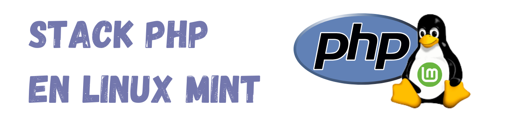

 
 

# Stack PHP en Linux
 

## 📖 Tabla de contenidos

Mostrar contenidos

 
   
- [Sobre esta guía](#-sobre-esta-guía)
- [Consideraciones iniciales](#-consideraciones-iniciales)
- [Advertencias](#-advertencias)
- [Listado de aplicaciones y tecnologías del stack](#-listado-de-aplicaciones-y-tecnologías-del-stack)
- [Cómo utilizar esta guía](#-cómo-utilizar-esta-guía)
- [Índice de instalaciones](#-índice-de-instalaciones)
- [Instalación de otras aplicaciones en Linux (Chrome, ...)](#-instalación-de-otras-aplicaciones-en-linux)
- [Personalizaciones básicas de Linux Mint](#-personalizaciones-básicas-de-linux-mint)
   

 

## ✔ Sobre esta guía

Esta guía contiene instrucciones para ayudar a crear un "stack" de desarrollo mínimo basado en el lenguaje PHP.

>[!IMPORTANT]
>
>Me encantaría que esta guía fuera infalible y no tuviera ningún error, pero desgraciadamente no lo puedo garantizar, por lo que te recomiendo que la sigas con precaución, y que si crees que algún paso no es correcto, lo contrastes antes de seguirlo. 
>
>Lee con atención todo el README antes de comenzar ninguna instalación.
>
>La guía sólo está pensada para usuarios que ya están familiarizados con las diferentes aplicaciones y tecnologías que se mencionan (PHP, Laravel, Xampp, Xdebug, etc...), pero que no han trabajado aún en sistemas operativos GNU/Linux y necesitan una orientación a la hora de "trasladar" su stack de desarrollo a este sistema operativo.

[🔝](#stack-phpvuejs-en-linux)
 
 

## ✏ Consideraciones iniciales

>[!NOTE]
>
>**Distribución GNU/Linux:** esta guía se ha creado usando como sistema operativo la distribución de Linux Mint 21.3 (Virginia) con entorno de escritorio Cinnamon.
>
>**Versión de PHP:** la versión de PHP que se utiliza en esta guía es la 8.2.4

>[!CAUTION]
>
>**Instalación de PHP:** dado que se trata de crear un stack de desarrollo con PHP, es necesario que tu ordenador tenga instalada alguna versión de PHP, y algunas de las aplicaciones/tecnologías utilizadas (como VSC o Xdebug) estarán relacionadas con dicha instalación. Es **muy importante que tengas en cuenta que para esta guía utilizo la instalación de PHP que viene con la instalación de Xampp**, por lo que si prefieres utilizar una instalación de PHP independiente del paquete Xampp, esta guía tal vez no te sirva.

[🔝](#stack-phpvuejs-en-linux)
 
 

## ⚠ Advertencias

>[!WARNING]
>
>No es una guía sobre el uso de aplicaciones/tecnologías, sino para ayudar a su instalación el Linux, aunque puede contener orientaciones básicas de uso en algún caso.
>
>
>Los procedimientos descritos en esta guía no son los únicos, puesto que hay diferentes maneras de hacer las cosas. Simplemente he elegido los que me han parecido más convenientes y/o sencillos.

>[!CAUTION]
>
>No puedo garantizar al 100% que todos estos procedimientos funcionen en tu máquina, por lo que antes de ejecutarlos, te aconsejo que los analices con detenimiento para ver si son adecuados para tu situación.

>[!TIP]
>
>La guía contiene un apartado de "personalización básica de Linux" y otro de "instalación de aplicaciones", que si bien no tienen que ver directamente con la creación del stack de desarrollo, sí es interesante que le eches un vistazo.

[🔝](#stack-phpvuejs-en-linux)
 
 

## 🧾 Listado de aplicaciones y tecnologías del stack

El número de aplicaciones y tecnologías incluidos en esta guía puede ir creciendo con el tiempo, pero las más importantes son las siguientes:

- PHP
- Xampp y Xdebug
- Git y GitHub
- Visual Studio Code
- Laravel, como framework de backend
- Composer
- Node.js y NPM
- Vue.js como framework de frontend
- Docker

[🔝](#stack-phpvuejs-en-linux)
 
 

## 🧭 Cómo utilizar esta guía

Los diferentes procedimientos de instalación/configuración contenidos en esta guía siguen un orden concreto que está pensado para instalar en primer lugar determinados componentes que son requisitos necesarios para otros componentes que se instalan más adelante.

Por este motivo, te recomiendo que si lo que necesitas es crearte el stack completo, sigas el orden que te marco en el **Indice de instalaciones**.

[🔝](#stack-phpvuejs-en-linux)
 
 

## 📋 Índice de instalaciones

1. [XAMPP](/Stack%20principal/01-XAMPP.md)

2. [Xdebug](/Stack%20principal/02-Xdebug.md)

3. [Git Y GitHub](/Stack%20principal/03-Git-y-GitHub.md)

4. [Visual Studio Code](/Stack%20principal/04-VSC.md)

5. [Composer](/Stack%20principal/05-Composer.md)

6. [Laravel](/Stack%20principal/06-Laravel.md)

7. [Node.js](/Stack%20principal/07-NodeJs.md)

8. [Vue.js](/Stack%20principal/08-VueJs.md)

9. [Docker](/Stack%20principal/09-Docker.md)

[🔝](#stack-phpvuejs-en-linux)
 
 

## 📦 Instalación de otras aplicaciones en Linux

Aparte de las aplicaciones que configuran el stack principal de PHP, hay ciertas aplicaciones que puede que te interese conocer cómo se instalan en Linux Mint.

Mostrar aplicaciones

 
   
- [Actualización de paquetes APT](/Otras%20aplicaciones/Actualización-de-paquetes.md)
- [Google Chrome](/Otras%20aplicaciones/Google-Chrome.md)
   

 
    
[🔝](#stack-phpvuejs-en-linux)
 
 

## 🎨 Personalizaciones básicas de Linux Mint

Este apartado no es necesario para instalar las aplicaciones/tecnologías propias del stack de PHP, pero he creido interesante añadir una serie de sugerencias para personalizar/configurar nuestro Linux Mint.

Mostrar contenido

 
   
- [Personalizaciones](Personalización%20Linux%20Mint/Personalizaciones-básicas.md)
- [Configuraciones](Personalización%20Linux%20Mint/Configuraciones-básicas.md)
   

 
    
[🔝](#stack-phpvuejs-en-linux)
 
 

